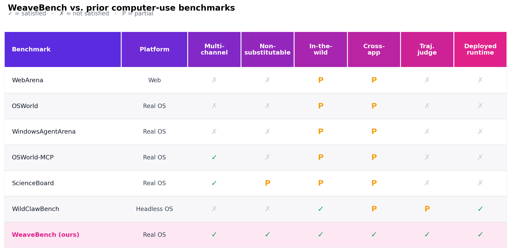
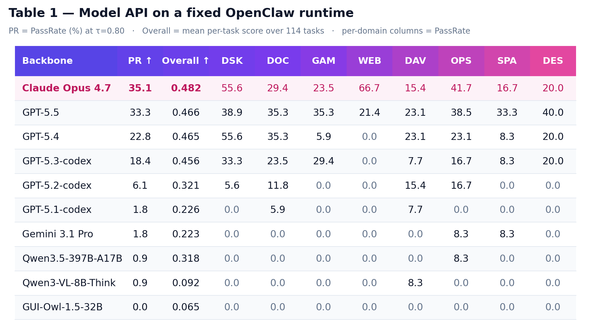
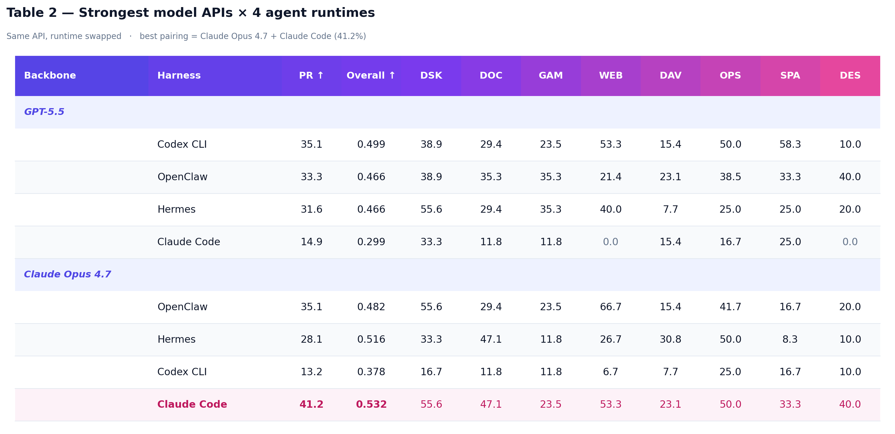

# WeaveBench

> **WeaveBench: A Long-Horizon, Real-World Benchmark for Computer-Use Agents with Hybrid Interfaces**

<p align="center">
<a href="https://arxiv.org/abs/2606.09426"></a>
<a href="https://weavebench.github.io"></a>
<a href="https://huggingface.co/datasets/wanlilll/WeaveBench"></a>
<a href="https://huggingface.co/papers/2606.09426"></a>
<a href="./LICENSE"></a>
</p>

**A benchmark for computer-use agents that weave GUI and CLI/code together in real deployed runtimes.** 114 long-horizon, real-world tasks across 8 work domains, each requiring the agent to **interleave GUI observation with CLI/code execution in one trajectory**, scored by a **trajectory-aware Agent-as-Judge** that reads the full chat trace + deliverables and zeroes fabricated evidence. The best frontier pairing clears just **41.2%** — far from saturation.

## 📰 News

- **2026-06-12** — WeaveBench hit **#4 on [Hugging Face Daily Papers](https://huggingface.co/papers/2606.09426)** (104 upvotes). 🎉
- **2026-06-10** — Evaluated **9 frontier backbones × 4 agent runtimes** (OpenClaw, Codex CLI, Claude Code, Hermes); best pairing tops out at **41.2% PassRate**. Full leaderboard in [`docs/REPRODUCE.md`](./docs/REPRODUCE.md).
- **2026-06-08** — Initial preprint and [project website](https://weavebench.github.io) live.
- **2026-06-06** — Released the **OSWorld hybrid-scoring experiment** (CLI agent vs vision, native grading + agent-as-judge re-judge) under [`experiments/osworld_hybrid/`](./experiments/osworld_hybrid).

<sub>Want your model on the board? See [Submit your results](#-submit-your-results).</sub>

## TL;DR

**What** — 114 long-horizon tasks across 8 domains (WEB, DAV, OPS, DOC, DES, GAM, SPA, DSK), sourced from real user requests with traceable provenance.

**The twist** — Each task is *channel-non-substitutable*: no single-channel rewrite can solve it. GUI exposes transient rendered state (canvas, dialogs, charts); CLI/code carries persistent state (configs, logs, services). You need both, woven together.

**Scoring** — A trajectory-aware agentic judge re-fetches evidence over multiple turns and **zeros any rollout with high-confidence fabrication** (synthetic screenshots, hard-coded metrics). Outcome-only grading overestimates GPT-5.5 by **+20 pts** (53.5% → audited 33.3%).

**Headline** — Best model-runtime pairing (Claude Opus 4.7 + Claude Code) = **41.2% PassRate**, vs >78% the same backbones reach on OSWorld-Verified.

## 🎬 Demo

<p align="center">
  <video src="https://github.com/weavebench/WeaveBench/raw/main/docs/media/rabbitmq_dlq_demo.mp4" width="100%" controls muted>
    <!-- Fallback for renderers that don't inline video (e.g. some mirrors) -->
    <a href="https://weavebench.github.io/static/videos/rabbitmq_dlq_topology_mgmt.mp4">▶ Watch the demo</a>
  </video>
</p>

<p align="center">
  <em>An agent diagnosing a RabbitMQ dead-letter-queue routing black-hole end-to-end (OPS domain, sped up 10×). It cross-checks the broker over the CLI and the Management UI on screen, fixes the binding, and re-verifies — exactly the GUI↔CLI interleaving WeaveBench requires.</em>
</p>

<br />

<p align="center">
  
</p>

<p align="center">
  <em>Three more cross-channel workflows at a glance. Browse <a href="https://weavebench.github.io">all task demos on the website</a>.</em>
</p>

## Why hybrid interfaces? (the core claim)

## Why hybrid interfaces? (the core claim)

GUI and CLI/code carry **fundamentally different state**, so neither suffices alone — GUIs expose transient rendered state (canvases, dialogs, chart tooltips, spatial layout) that no API returns, while CLI/code carries persistent scriptable state (source, configs, logs, services) that no screenshot can produce. WeaveBench admits a task only when success *requires* weaving the two together (criterion P1 in the paper). That single admission rule is what separates it from prior "multi-interface" benchmarks where the extra channel is a convenience, not a requirement:

<p align="center">
  
</p>

> Full positioning table + per-task falsifiers in the [paper](https://arxiv.org/abs/2606.09426).

## Anatomy of a task

Take **`OPS_task_17_rabbitmq_dlq_topology_mgmt`** (the demo above). An SRE alert says the `orders.dlq` dead-letter queue is stuck at depth 0 while ~30% of orders are being nack'd and silently vanishing. The agent must produce a paste-ready post-mortem — and the evidence has to **cross-validate two channels**.

**Why it can't be done from one channel:**

| Step | Channel | What happens |
|---|---|---|
| 1. Snapshot the broker | 🖥️ CLI | `rabbitmqctl list_queues` → `orders.dlq` depth ≈ 0 but `orders.audit` keeps growing |
| 2. Dump bindings + queue args | 🖥️ CLI | `x-dead-letter-routing-key=dead.unrouted` ≠ the binding's literal `dead.routed.*` — **root cause is a routing-key typo a topic exchange won't wildcard-match** |
| 3. Visualize the rate gap | 🪟 GUI | Hover the Management UI's *Message rates* chart so the publish-vs-deliver gap (≥4 msg/s) is readable in a tooltip — **a number no JSON dump renders the same way** |
| 4. Fix + re-bind | 🖥️ CLI | Write a re-entrant `06_remediation.sh` that re-binds `orders.dlx → orders.dlq` on `dead.unrouted` |
| 5. Prove the fix landed | 🪟 GUI | Re-screenshot the Overview after ≥10 s — DLQ depth now climbs to ≥20, **visible on the live panel** |

The judge then checks an explicit **cross-channel evidence chain** (`cross_channel.json`: ≥5 channel switches, ≥2 `STRUCT:` + ≥2 `VISUAL:` entries). Skip either channel and the score is **hard-capped at 0.4** — you cannot pass by dumping JSON alone or by screenshotting alone.

**Anti-gaming is built in:** text dumps must trace back to real broker queries in the action log (no `echo`-ing the answer), and screenshots must be real Management-UI renders — a PIL-drawn PNG that satisfies a file-existence check gets zeroed by the judge's VLM rubric.

## 🏅 Leaderboard (from the paper)

**Table 1 — Fixed harness (OpenClaw), varying backbone.** PR = PassRate (%) at τ=0.80; Overall = mean per-task score over all 114 tasks. Per-domain columns are PassRate.

<p align="center">
  
</p>

**Table 2 — Strongest APIs × 4 agent runtimes.** Same model API, runtime swapped. The model on its native runtime dominates; cross-pairing collapses.

<p align="center">
  
</p>

> Two findings the numbers make concrete: **(1)** frontier backbones report >78% on OSWorld-Verified — WeaveBench is **far from saturation**; **(2)** runtime alignment matters as much as the model — the *same* GPT-5.5 API swings **20 pts** (35.1% on Codex CLI → 14.9% on Claude Code). The two most GUI-heavy domains (SPA, DES) are the bottom of the table for nearly every backbone, pinning the GUI side as the binding constraint. Reproduce exactly with [`docs/REPRODUCE.md`](./docs/REPRODUCE.md); [submit your own pairing](#-submit-your-results).

## The trajectory-aware judge — and why outcome-only grading lies

The embedded file-only `grade(...)` in each task is **spoofable**: an agent can fabricate a PNG that passes a file-existence + OCR check. WeaveBench instead scores with a host-side agentic judge that reads (a) the task spec, (b) the agent's `chat.jsonl` trace, and (c) the unpacked deliverables, decomposes each deliverable into verifiable clauses, scores 8 process+outcome dimensions, and **zeroes any rollout where it can verbatim-quote a fabrication signature**.

The gap is not academic: without this audit, **GPT-5.5 would appear to pass 53.5% instead of the audited 33.3%.** Details in [`docs/AGENT_JUDGE.md`](./docs/AGENT_JUDGE.md) and [`docs/ARCHITECTURE.md`](./docs/ARCHITECTURE.md).

---

## Try it in 30 seconds (no VM, no API key)

```bash
git clone https://github.com/weavebench/WeaveBench.git && cd WeaveBench
pip install -e .
weavebench-demo
```

Prints a real `score.json` from a paper-canonical Claude Opus 4.7 attempt at `WEB_task_1_mockup_pixel_diff` — judge model, per-artifact evidence quotes, the works. ~1 second, no network calls. See what scoring looks like before spinning up a 29.5 GB qcow2.

## Full setup

<details>
<summary><b>Requirements</b></summary>

| What | Why |
|---|---|
| Linux host with **KVM** + **Docker** (≥ 8 CPU, ≥ 32 GB RAM, ≥ 150 GB free disk) | Every task spins up an Ubuntu VM (OSWorld-derived). QEMU runs **inside** the `happysixd/osworld-docker` container, so the host needs only Docker + `/dev/kvm` — **no host `qemu-system-x86_64` install required.** |
| Python ≥ 3.10.12, Node ≥ 22 | Node powers the host-side OpenClaw judge (`npm install -g openclaw`) |
| **OpenRouter API key** | Used by both the agent and the trajectory-aware judge — both default to `openai/gpt-5.5`. `export OPENROUTER_API_KEY=...` |

> 🇨🇳 **Users in China**: `export HF_ENDPOINT=https://hf-mirror.com` (all `weavebench-download-*` honor it). hf-mirror is reachable directly — don't put it behind an HTTP proxy. On a 429, lower parallelism with `--max-workers 2` and re-run (downloads resume).

**Resource budget:** one-time setup is **~29.5 GB** (207 MB tasks + 852 MB runtime + 28.46 GB qcow2 + 7 KB judge template). Already have an OSWorld qcow2? Use `bash scripts/setup.sh --skip-vm` and save 28 GB. `OSWORLD_LOCAL_QCOW2_PATH` skips the VM *disk* download, not the docker *engine* image — `setup.sh` pre-pulls that so the first run doesn't stall.

</details>

```bash
git clone https://github.com/weavebench/WeaveBench.git && cd WeaveBench

export OPENROUTER_API_KEY=sk-or-v1-...
# Optional: export HF_ENDPOINT=https://hf-mirror.com   # if in China
# Optional: export HF_TOKEN=hf_...                     # higher HF rate limits

bash scripts/setup.sh                          # installs + downloads dataset + runtime + 28 GB qcow2
```

`scripts/setup.sh` runs prereq checks → `pip install -e .` → `npm install -g openclaw` → `weavebench-download-{dataset,assets,judge,vm}` and prints the next command. Pass `--skip-vm` if you already have a qcow2 (then `export OSWORLD_LOCAL_QCOW2_PATH=...`).

<details>
<summary><b>Bake a harness into the qcow2 (recommended one-time step)</b></summary>

Otherwise every VM boot re-uploads the harness runtime (~70–500 MB) and installs it on that VM's first task (~3–5 min each time); a baked image boots ready.

```bash
# One-time, ~25 min. STAGE_DIR = a fast local disk (reads+writes the 28 GB image).
# PROMOTE=1 makes the baked image the default (no env var needed to Run).
STAGE_DIR=/path/to/ssd PROMOTE=1 \
  scripts/bake_harness_into_qcow2.sh openclaw      # or: codex | claudecode | hermes
```

The bake boots an isolated VM, runs the *same* bootstrap the runtime uses, flushes the install back into the qcow2, and re-boots read-only to verify. All four harnesses (`openclaw`, `codex`, `claudecode`, `hermes`) are supported — each produces a **separate** image, so bake the one(s) you plan to run and point `OSWORLD_LOCAL_QCOW2_PATH` at the match (or `PROMOTE=1` the one you use most). Run `scripts/download_assets.sh <harness>` first if you haven't fetched its tarball. In a hurry? Skip it and run directly — just re-installs per VM's first task.

</details>

## Run

Scoring runs a second OpenClaw (the judge) **on the host**, so point it at the judge template `setup.sh` installed (it prints these three lines):

```bash
export AJ_OPENCLAW_BIN=$(command -v openclaw)
export AJ_TEMPLATE_PROFILE=$HOME/judge_agent_test/template_profile
export AJ_TEMPLATE_WORKSPACE=$HOME/judge_agent_test/template_workspace
```

```bash
# If you baked with PROMOTE=1, the default image already has OpenClaw.
# Otherwise: export OSWORLD_LOCAL_QCOW2_PATH=./cache/vm/Ubuntu.qcow2

# Smoke test: one WEB task (trailing _ matters — bare 'task_1' also matches task_10..19)
weavebench-run \
    --harness openclaw \
    --model openai/gpt-5.5 \
    --tasks_root ./cache/tasks \
    --domains WEB \
    --task_filter task_1_ \
    --result_dir ./results/smoke

# Full 114-task sweep (multi-hour; tune --num_envs to your host)
weavebench-run \
    --harness openclaw \
    --model openai/gpt-5.5 \
    --tasks_root ./cache/tasks \
    --num_envs 8 \
    --result_dir ./results/run
```

Swap `--harness` to `codex`, `claudecode`, or `hermes` (each can be baked the same way — see the bake section). Swap `--model` to anything OpenRouter exposes (`anthropic/claude-opus-4.7`, `google/gemini-2.5-pro`, …).

### Convenience smoke scripts

Two wrappers in `examples/` save you typing the full command. Both fetch the harness runtime tarball automatically if it's missing (setup.sh only pre-downloads openclaw), and both **auto-detect a baked image** for the harness: if one exists it's used (boot-ready), otherwise the run proceeds on the plain image and the harness installs on the VM's first task (~3-5 min). Pass `--bake` to bake first (~25 min one-time) and run on the fresh baked image.

```bash
# One harness — pick whichever you want to test:
bash examples/run.sh openclaw        # default if no arg
bash examples/run.sh codex
bash examples/run.sh hermes
bash examples/run.sh codex --bake    # bake first, then run

# Several harnesses in one go — pass the ones you want (omit to run all four):
bash examples/run_all_harnesses.sh codex hermes     # just these two
bash examples/run_all_harnesses.sh                  # all four, sequentially
bash examples/run_all_harnesses.sh --bake           # all four, baking each first
```

`run_all_harnesses.sh` runs each harness sequentially and prints a PASS/FAIL summary. Override the model with `MODEL=anthropic/claude-opus-4.7 bash examples/run.sh codex`. Each writes to `./results/<harness>_smoke/`.

> `--task_filter` (run time) is a substring match on task ids; the downloader's `--include` is an HF path glob — not the same syntax. To download a subset: `weavebench-download-dataset --include 'tasks/WEB/WEB_task_1_*'`.

<details>
<summary><b>Optional env vars</b></summary>

```bash
export OPENROUTER_BASE_URL=...                       # default https://openrouter.ai/api/v1
export JUDGE_MODEL=anthropic/claude-opus-4.7         # judge defaults to openai/gpt-5.5
export WEAVEBENCH_DATASET_REVISION=<full sha>        # pin to the paper's exact dataset commit
```

Both the agent and the judge default to `openai/gpt-5.5` — one model, one billing line. Pass `--model <other>` to change the agent and/or `JUDGE_MODEL=<other>` to change just the judge. See [`docs/REPRODUCE.md`](./docs/REPRODUCE.md) for the exact backbones used in the paper.

</details>

## Output

```
results/run/<mode>/<model>/<DOMAIN>/<task>/
  ├── chat.jsonl            # LLM trace
  ├── agent.log
  ├── results.tar.gz        # files the agent produced
  └── score.json            # trajectory-aware judge: per-clause evidence + overall_score
```

Scoring runs automatically — every task is judged by a separate OpenClaw on the host that reads the deliverables + chat trace. See [`docs/AGENT_JUDGE.md`](./docs/AGENT_JUDGE.md).

## 🏆 Submit your results

Run the full 114-task sweep and we'll add your model-runtime pairing to the leaderboard:

1. `weavebench-run` over all 114 tasks with a pinned `WEAVEBENCH_DATASET_REVISION` (see [`docs/REPRODUCE.md`](./docs/REPRODUCE.md)).
2. Open an issue titled `[leaderboard] <model> + <harness>` and attach your per-task `score.json` files (or a tarball of `results/`).
3. We re-verify a sample and update the board.

Reproducing paper numbers exactly? [`docs/REPRODUCE.md`](./docs/REPRODUCE.md) has the pinned dataset revision, model snapshot ids, and per-table commands.

## More

- OSWorld hybrid-scoring experiment (CLI agent vs vision, native + agent-as-judge): [`experiments/osworld_hybrid/`](./experiments/osworld_hybrid)
- Architecture: [`docs/ARCHITECTURE.md`](./docs/ARCHITECTURE.md)
- Agent-as-Judge setup: [`docs/AGENT_JUDGE.md`](./docs/AGENT_JUDGE.md)
- Reproducing paper numbers: [`docs/REPRODUCE.md`](./docs/REPRODUCE.md)
- Contributing: [`CONTRIBUTING.md`](./CONTRIBUTING.md) · Changelog: [`CHANGELOG.md`](./CHANGELOG.md)
- Dataset + runtime + qcow2: [🤗 Dataset](https://huggingface.co/datasets/wanlilll/WeaveBench)

## Citation

```bibtex
@article{li2026weavebench,
  title         = {WeaveBench: A Long-Horizon, Real-World Benchmark for Computer-Use Agents with Hybrid Interfaces},
  author        = {Li, Wanli and Zhou, Bowen and Yu, Yunyao and Xu, Zhou and Yang, Yifan and Li, Dongsheng and Shan, Caihua},
  year          = {2026},
  eprint        = {2606.09426},
  archivePrefix = {arXiv},
  primaryClass  = {cs.AI},
  url           = {https://arxiv.org/abs/2606.09426},
}
```

## Acknowledgements

Built on [OpenClaw](https://github.com/openclaw/openclaw), [Codex CLI](https://github.com/openai/codex), [Claude Code](https://github.com/anthropics/claude-code), [Hermes-Agent](https://hermes-agent.nousresearch.com), [OSWorld](https://github.com/xlang-ai/OSWorld), and [WildClawBench](https://github.com/internlm/WildClawBench).
